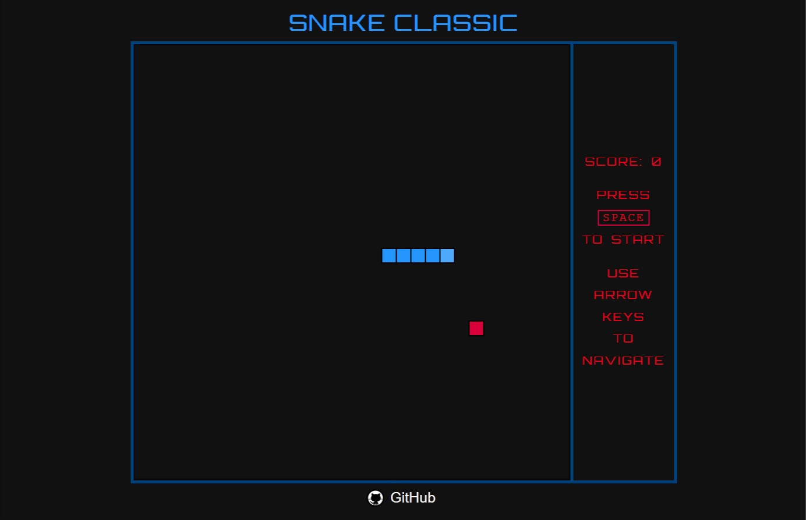

# Classic Snake Game

#### Demo: <https://shivavamsi.github.io/classic-snake-game/>

Read more about the game on [Wikipedia](https://en.wikipedia.org/wiki/Pig_(dice_game)

## Description

This web application allows the solo player to play classic Snake Game

### Gameplay

-   _player uses the "Space" key to start the game._
-   _Player controls the snake using the Arrow keys._
-   _Food for the snake is displayed on the screen as a red dot._
-   _Player should control and let the snake feed to gain score._
-   _The snake moves faster as the score increases._
-   _The snake grows longer as it feeds on the food._
-   _The game ends when the snake bites itself (or) the snake hits the wall_

### Screenshot

## Notes

-   _Used Props for parent-child communication_
-   _Used Event bus to communicate events_
-   _Used Refs to access DOM elements_
-   _Initialized the game during the "mounted" stage of Vue Instance Life Cycle_

#### App Model
                                            Main.js
                                               |
                                               |
                                               |
                                               |
                                        ClassicSnake.Vue
                                 /          /      \          \
                                /          /        \          \
                               /          /          \          \
                              /          /            \          \
                GameHeader.Vue  GameView.Vue  GameController.Vue  GameFooter.vue

#### _Technologies Used:_

-   _Vue.js_
-   _HTML_
-   _CSS_
-   _JavaScript_
